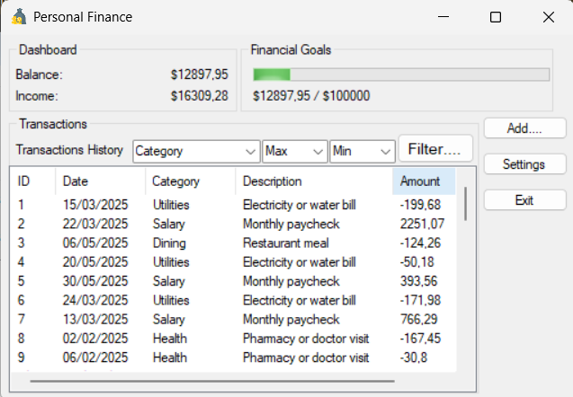
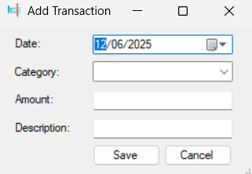
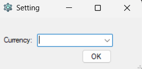

# 💰 Personal Finance Manager (Windows Forms App)

A simple and intuitive desktop application built using C# and Windows Forms to manage your personal income and expenses. Track transactions, set financial goals, and stay on top of your budget.

---

## ✨ Features

- Add, edit, and delete transactions (income/expenses)
- View balance, income, and progress toward financial goals
- Filter transactions by category and amount range
- Switch display currency from the settings form
- Persistent transaction data stored in JSON file
- Clean and user-friendly UI

---

## 🖼️ Screenshots

### 📋 Main Dashboard


### ➕ Add Transaction


### ⚙️ Settings Form


### ✏️ Edit/Delete Transaction


---

## 🛠️ Built With

- C# (.NET Framework)
- Windows Forms (WinForms)
- System.Text.Json for data persistence
- Visual Studio

---

## 📦 Getting Started

1. **Clone the repo:**

```bash
git clone https://github.com/your-username/PersonalFinanceManager_DesktopApp.git
```

2. **Open the solution** in Visual Studio

3. **Build and run** the project (F5)

4. You're ready to go!

> Note: Make sure `transactions_sample.json` exists in the executable directory.

---

## 📁 Folder Structure

```
PersonalFinanceManager_DesktopApp/
├── Forms/
│   ├── MainForm.cs
│   ├── AddTransactionForm.cs
│   ├── EditOrDeleteForm.cs
│   └── SettingForm.cs
├── Models/
│   └── Transaction.cs
├── screenshots/
│   ├── mainform.png
│   ├── addtransaction.png
│   ├── settings.png
│   └── editdelete.png
├── transactions_sample.json
├── Program.cs
└── README.md
```

---

## 📃 License

This project is licensed under the **MIT License**. See the [LICENSE](LICENSE) file for details.

---

### 👍 If you find this project helpful, feel free to star the repo!